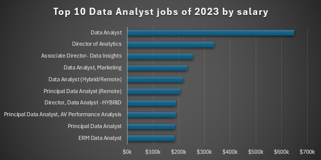
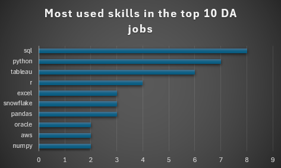
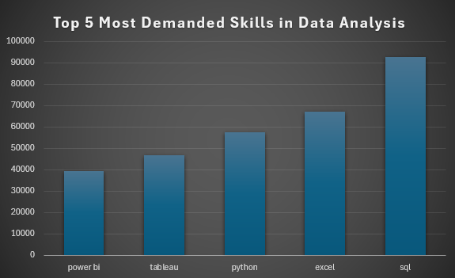
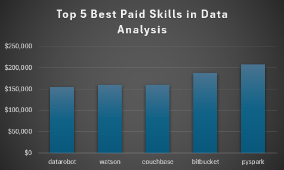

## 📊 SQL Data Analyst Job Market Analysis

### 🚀 Project Overview
This project analyzes the data‑analyst job market in 2023, focusing on remote/hybrid roles—to identify:

- **Top‑paying positions**  
- **Most in‑demand skills**  
- **“Optimal” skills** that balance high salary and high demand  

---

> **📌 Data Source Credit:**  
> The job postings database used in this project was originally created and shared by **[Luke Barousse](https://github.com/lukebarousse)**.  
> Full credit goes to him for compiling and publishing the dataset. This project builds upon that foundation for further analysis and visualization.

---

### 🛠 Tools I used for this project

| Tool             | Purpose                                             |
|------------------|-----------------------------------------------------|
| **PostgreSQL**   | Store & query job‑posting data                      |
| **SQL**          | Primary language for data extraction & analysis     |
| **VS Code**      | Write & manage SQL scripts                          |
| **Git / GitHub** | Version control & project hosting                   |

---

### 📂 Database Schema

Four main tables power our analysis:

| Table Name           | Description                               |
|----------------------|-------------------------------------------|
| `company_dim`        | Company metadata                          |
| `skills_dim`         | Definitions & categories of skills        |
| `job_postings_fact`  | Details of each job posting               |
| `skills_job_dim`     | Many‑to‑many mapping: jobs ↔ required skills |

**Setup scripts**  
1. `1_create_database.sql` – Create the database  
2. `2_create_tables.sql`   – Define tables & constraints  
3. `3_modify_tables.sql`   – Import CSV data into tables  (modify the path to match yours)

---

### 🔍 The Analysis

> See the SQL queries right here: [sql_project_data_analysis](/sql_project/)

### 1. Top‑Paying Remote Data Analyst Roles

**What I did:**  
I selected the top 10 fully remote “Data Analyst” roles by average annual salary, joining the postings fact table to company metadata to get company names.

```SQL
-- 1_top_paying_jobs.sql
SELECT
    job_id,
    job_title,
    name AS company_name,
    job_location,
    job_schedule_type,
    salary_year_avg,
    job_posted_date
FROM
    job_postings_fact
LEFT JOIN
    company_dim ON company_dim.company_id = job_postings_fact.company_id
WHERE
    job_title_short = 'Data Analyst'
    AND job_location = 'Anywhere'
    AND salary_year_avg IS NOT NULL
ORDER BY
    salary_year_avg DESC
LIMIT 10;
```

### Key Insights of the top 10 Data Analyst jobs of 2023
- **Leadership dominates**: 4 of the top 10 roles are director-level or principal analysts 💼
- **Specialization pays**: "AV Performance Analysis" and "ERM" command premium salaries 🚀

  
*This Clustered Bar was made using Excel*

### 2. Skills for Those Top‑Paying Jobs

**What I did:**  
I built a CTE of the top 10 remote data‑analyst roles (from Query 1) then joined through the skills mapping tables to list every skill required by those top‑paying positions.

```SQL
-- 2_top_paying_job_skills.sql
WITH top_10_remote_data_analyst AS (
    SELECT
        job_id,
        job_title,
        salary_year_avg,
        name AS company_name
    FROM
        job_postings_fact
    LEFT JOIN
        company_dim ON company_dim.company_id = job_postings_fact.company_id
    WHERE
        job_title_short = 'Data Analyst'
        AND job_location = 'Anywhere'
        AND salary_year_avg IS NOT NULL
    ORDER BY
        salary_year_avg DESC
    LIMIT 10
)
SELECT
    t.job_id,
    t.job_title,
    t.company_name,
    t.salary_year_avg,
    s.skills
FROM
    top_10_remote_data_analyst AS t
INNER JOIN
    skills_job_dim AS sj ON sj.job_id = t.job_id
INNER JOIN
    skills_dim AS s ON s.skill_id = sj.skill_id
ORDER BY
    t.salary_year_avg DESC;
```
### Key Insights of the most demanded skills of top Data Analyst jobs of 2023:
- **SQL & Python rule**: Found in 100% of top jobs (based on your scale: 9/9)
- **BI tools matter**: Tableau and Snowflake are critical
- **Cloud & libraries**: AWS (cloud) and Pandas/Numpy (Python) reflect modern workflows ☁️

  
*This Clustered Bar was made using Excel*

### 3. Most In‑Demand Skills for Data Analysts

**What I did:**  
I counted how many times each skill appears across all “Data Analyst” postings, then listed the top 5 by frequency.

```SQL
-- 3_most_in_demand_skills.sql
SELECT
    s.skills,
    COUNT(*) AS count_of_skills
FROM
    job_postings_fact AS j
INNER JOIN
    skills_job_dim AS sj ON sj.job_id = j.job_id
INNER JOIN
    skills_dim AS s ON s.skill_id = sj.skill_id
WHERE
    j.job_title_short = 'Data Analyst'
GROUP BY
    s.skills
ORDER BY
    count_of_skills DESC
LIMIT 5;
```
### Key Insights of the top 5 most demanded skills for Data Analyst jobs of 2023:
- **Fundamental Trio**: Excel + SQL + Python are non-negotiable for analysts 📌
- **Visualization Focus**: The next most demanded skills are visualization tools 🎨

  
*This Clustered Column was made using Excel*

### 4. Highest‑Paying Skills in Remote Data Analyst Roles

**What I did:**  
I averaged the salary for each skill among fully remote “Data Analyst” postings, then picked the top 5 highest‑paying skills.

```SQL
-- 4_top_paying_skills.sql
SELECT
    s.skills,
    ROUND(AVG(j.salary_year_avg)) AS salary_avg
FROM
    job_postings_fact AS j
INNER JOIN
    skills_job_dim AS sj ON sj.job_id = j.job_id
INNER JOIN
    skills_dim AS s ON s.skill_id = sj.skill_id
WHERE
    j.job_title_short = 'Data Analyst'
    AND j.salary_year_avg IS NOT NULL
    AND j.job_work_from_home = TRUE
GROUP BY
    s.skills
ORDER BY
    salary_avg DESC
LIMIT 5;
```
### Key Insights of the top 5 highest paid skills for Data Analyst jobs of 2023:
- **Niche tools**: Skills like "Distarobot" and "Couchbase" top salary charts 🚀
- **Big Tech influence**: Watson (IBM) and PySpark (Spark) reflect enterprise demand 💻 

   
*This Clustered Column was made using Excel*

### 5. “Optimal” Skills (Balancing Demand & Pay)

**What I did:**  
I computed two CTEs: one counting how often each skill appears in remote data‑analyst postings, the other averaging salary by skill. Then I joined them, filtered for skills with >10 postings, and ordered by salary and demand.

```SQL
-- 5_top_optimal_skills.sql
WITH most_in_demand_skills AS (
    SELECT
        sd.skill_id,
        sd.skills,
        COUNT(*) AS count_of_skills
    FROM
        job_postings_fact AS j
    INNER JOIN
        skills_job_dim AS sj ON sj.job_id = j.job_id
    INNER JOIN
        skills_dim AS sd ON sd.skill_id = sj.skill_id
    WHERE
        j.job_title_short = 'Data Analyst'
        AND j.salary_year_avg IS NOT NULL
        AND j.job_work_from_home = TRUE
    GROUP BY
        sd.skill_id, sd.skills
),
top_paying_skills AS (
    SELECT
        sd.skill_id,
        sd.skills,
        ROUND(AVG(j.salary_year_avg)) AS salary_avg
    FROM
        job_postings_fact AS j
    INNER JOIN
        skills_job_dim AS sj ON sj.job_id = j.job_id
    INNER JOIN
        skills_dim AS sd ON sd.skill_id = sj.skill_id
    WHERE
        j.job_title_short = 'Data Analyst'
        AND j.salary_year_avg IS NOT NULL
        AND j.job_work_from_home = TRUE
    GROUP BY
        sd.skill_id, sd.skills
)
SELECT
    m.skill_id,
    m.skills,
    m.count_of_skills,
    t.salary_avg
FROM
    top_paying_skills AS t
INNER JOIN
    most_in_demand_skills AS m
    ON m.skill_id = t.skill_id
WHERE
    m.count_of_skills > 10
ORDER BY
    t.salary_avg DESC,
    m.count_of_skills DESC
LIMIT 25;
```

### Key Insights of the top 25 most demanded and highest paying skills for Data Analyst jobs of 2023:

- **Highest Paying**: Go ($115k) 🚀  
- **Most Popular**: Python (236 counts) 🐍  
- **Enterprise Tools**: SAS, Oracle, and Azure command premium salaries 💼  
- **BI Dominance**: Tableau has high adoption (230 counts) but mid-range pay 📈

| Rank | Skill        | 📊 Count | 💰 Avg Salary | Visual        |
|------|--------------|---------:|--------------:|---------------|
| 1    | **Go**       | 27      | $115,320     | ██████████    |
| 2    | Confluence   | 11      | $114,210     | █████████▊    |
| 3    | Hadoop       | 22      | $113,193     | █████████▌    |
| 4    | Snowflake    | 37      | $112,948     | █████████▍    |
| 5    | Azure        | 34      | $111,225     | █████████     |
| 6    | BigQuery     | 13      | $109,654     | ████████▊     |
| 7    | AWS          | 32      | $108,317     | ████████▌     |
| 8    | Java         | 17      | $106,906     | ████████▏     |
| 9    | SSIS         | 12      | $106,683     | ████████      |
| 10   | Jira         | 20      | $104,918     | ███████▊      |
| 11   | Oracle       | 37      | $104,534     | ███████▌      |
| 12   | Looker       | 49      | $103,795     | ███████▍      |
| 13   | NoSQL        | 13      | $101,414     | ███████▏      |
| 14   | **Python**   | 236     | $101,397     | ███████       |
| 15   | R            | 148     | $100,499     | ██████▊       |
| 16   | Redshift     | 16      | $99,936      | ██████▌       |
| 17   | Qlik         | 13      | $99,631      | ██████▍       |
| 18   | Tableau      | 230     | $99,288      | ██████▏       |
| 19   | SSRS         | 14      | $99,171      | ██████        |
| 20   | Spark        | 13      | $99,077      | █████▊        |
| 21   | C++          | 11      | $98,958      | █████▌        |
| 22   | SAS          | 126     | $98,902      | █████▍        |
| 23   | SQL Server   | 35      | $97,786      | █████▏        |
| 24   | JavaScript   | 20      | $97,587      | █████         |               

*ChatGPT generated this table from my query results*

---

### 🎯 Conclusions

- **SQL & Python** are non‑negotiable fundamentals.  
- **Specialized skills** (e.g., PySpark, cloud platforms) for premium pay.  
- **Visualization tools** (Tableau, Power BI) remain essential.  
- **Emerging trends**: Big‑data & cloud (Hadoop, Snowflake, Azure).  

---

_Developed by Ernesto Bello, April 2025_ 

